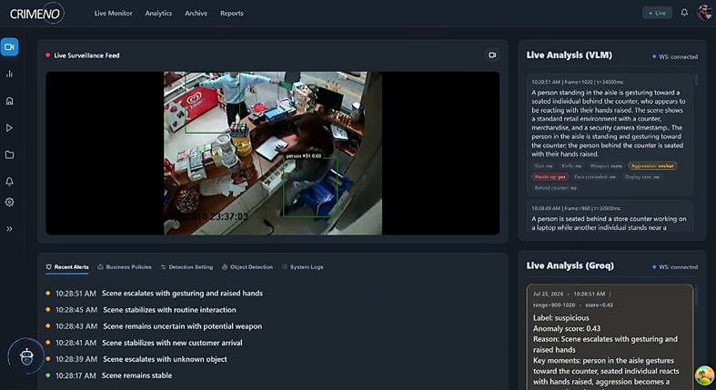
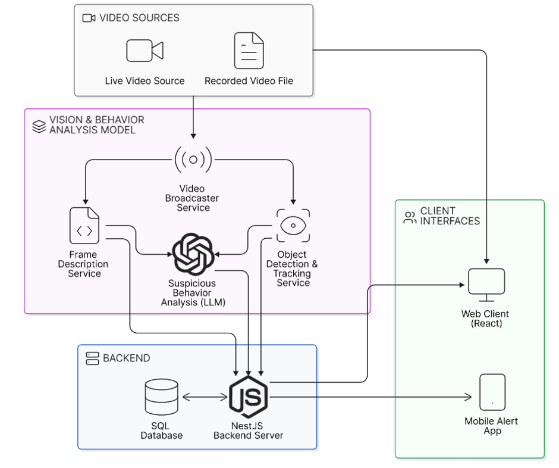
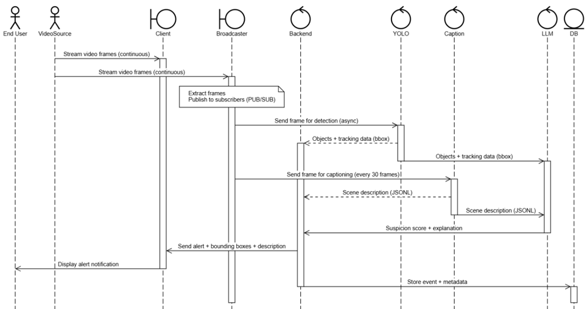
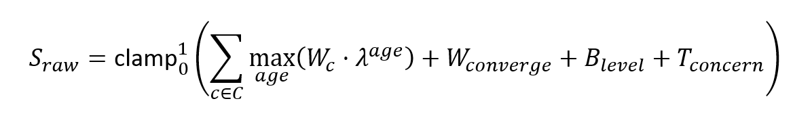
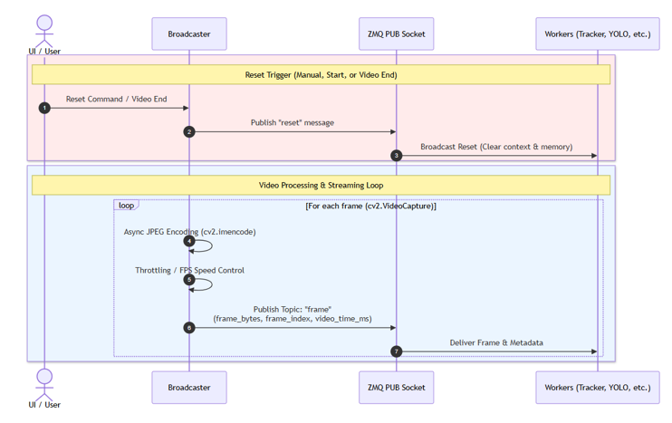
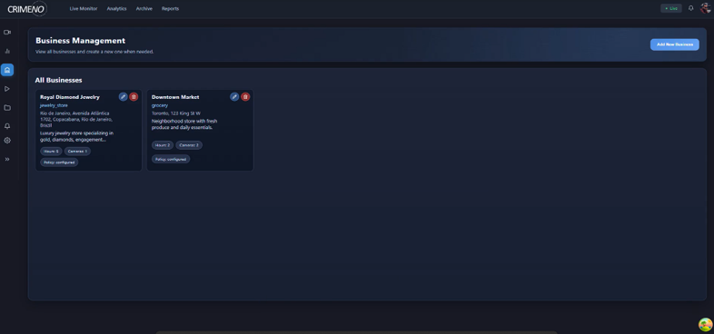
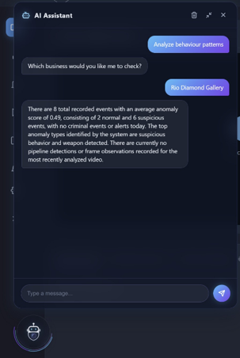
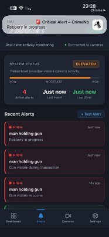
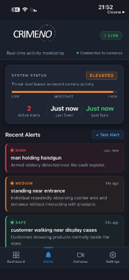
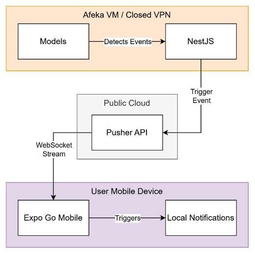

# CRIMENO - Criminal Activity Detection Models Pipeline

A real-time video pipeline that watches a store's camera feed, tracks people/objects, gets a
vision model's read on each scene, and turns that evidence into a deterministic
normal/suspicious/criminal verdict - streamed to a NestJS backend and a React dashboard.

> **Sibling repositories:** [CRIMENO-Backend](https://github.com/DcSlight/CRIMENO-Backend) (NestJS API + WebSocket relay + AI assistant) · [CRIMENO-Client](https://github.com/DcSlight/CRIMENO-Client) (React dashboard) · [CRIMENO-Mobile](https://github.com/DcSlight/CRIMENO-Mobile) (mobile app)



## Navigation

1. [Key Code References](#key-code-references)
2. [How to Run](#how-to-run)
3. [Architecture](#architecture)
4. [Services](#services)
   - [`video_broadcaster.py`](#video_broadcasterpy)
   - [`tracker/tracker_worker.py`](#trackertracker_workerpy)
   - [`vlm/vlm_worker.py` + `vlm/vlm_model.py`](#vlmvlm_workerpy--vlmvlm_modelpy)
   - [`groq/groq_anomaly_worker.py` + `groq/event_builder.py`](#groqgroq_anomaly_workerpy--groqevent_builderpy)
   - [`groq/scoring.py`](#groqscoringpy)
   - [`session_log.py`](#session_logpy)
   - [`eval/`](#eval)
5. [Message contracts](#message-contracts)
6. [Reset & sync flow](#reset--sync-flow)
7. [Logs & sessions](#logs--sessions)
8. [Evaluation & analytics](#evaluation--analytics)
9. [Configuration reference](#configuration-reference)
10. [Vision model selection](#vision-model-selection)
11. [System Showcase](#system-showcase)

---

## Key Code References

Direct links into the core logic, for anyone reviewing the project:

| Area                               | What it is                                                                   | Link                                                                           |
| ---------------------------------- | ---------------------------------------------------------------------------- | ------------------------------------------------------------------------------ |
| Deterministic scoring              | The full cue history → `(anomaly_score, label, threat_state)` function       | [`groq/scoring.py#L390-L531`](groq/scoring.py#L390-L531)                       |
| Cue weights & thresholds           | Evidence weight tables, scoring-level thresholds, decay/gate/latch constants | [`groq/scoring.py#L54-L186`](groq/scoring.py#L54-L186)                         |
| Weapon confidence grading          | Free-text `weapon` description → high/medium/low/none                        | [`groq/scoring.py#L260-L281`](groq/scoring.py#L260-L281)                       |
| Threat latching                    | Keeps "criminal" latched while an incident is ongoing                        | [`groq/scoring.py#L359-L388`](groq/scoring.py#L359-L388)                       |
| VLM output schema                  | The 10-field JSON schema every vision call must return                       | [`vlm/prompt.txt#L6-L20`](vlm/prompt.txt#L6-L20)                               |
| VLM frame receive → analyze → send | Main loop: pulls a frame, runs inference, pushes to Groq + NestJS            | [`vlm/vlm_worker.py#L211-L258`](vlm/vlm_worker.py#L211-L258)                   |
| Groq cue ingest & normalization    | Maps free-form VLM answers onto `{yes, no, unclear}`                         | [`groq/groq_anomaly_worker.py#L89-L128`](groq/groq_anomaly_worker.py#L89-L128) |
| Reset handshake (tracker side)     | Watcher thread: forwards reset, sends acks                                   | [`tracker/tracker_worker.py#L63-L96`](tracker/tracker_worker.py#L63-L96)       |
| Reset handshake (broadcaster side) | Sends reset, waits for acks, replies to NestJS                               | [`video_broadcaster.py#L136-L201`](video_broadcaster.py#L136-L201)             |
| Frame-overlap grading              | The accuracy/MAE/confusion-matrix core (`evaluate()`)                        | [`eval/metrics.py#L361-L444`](eval/metrics.py#L361-L444)                       |
| Unit tests — scoring               | Cases covering every scoring rule in `groq/scoring.py`                       | [`tests/test_scoring.py`](tests/test_scoring.py)                               |
| Unit tests — eval metrics          | Regression tests for frame-overlap grading & trend/severity                  | [`tests/test_metrics.py`](tests/test_metrics.py)                               |

---

## How to Run

### Prerequisites (one-time setup)

1. Install Python deps:
   ```bash
   pip install -r requirements.txt
   ```
2. Create a `.env` file in the project root (copy `.env.example`):
   ```
   GROQ_API_KEY=gsk_YOUR_KEY_HERE
   ```
   `GROQ_API_KEY` is required (used by the anomaly worker, Step 2). If you plan to run the VLM
   worker with `--backend online`, also set `GEMINI_API_KEY` (see
   [Vision model selection](#vision-model-selection)).
3. Install [Ollama](https://ollama.com/download) — it auto-starts in the system tray on Windows
   boot. Only needed for the VLM worker's default `--backend local`; skip if you'll only run
   `--backend online`.
4. Pull the local vision model (a few GB, once):
   ```bash
   ollama pull gemma3:4b
   ```

### Before each run

- Confirm Ollama is running (tray icon). It normally auto-starts, so this is usually already
  true — if not, open the Ollama app once.
- No other setup. The VLM worker talks to Ollama on `http://localhost:11434`.

### Launch order

Run each command in a **separate terminal**, from the project root.

**Step 1 — Video Broadcaster**

```bash
python video_broadcaster.py videos/shop.mp4
```

**Step 2 — Groq Anomaly Worker** (requires `GROQ_API_KEY`)

```bash
python groq/groq_anomaly_worker.py \
  --ws_url ws://127.0.0.1:3000/ws/groq \
  --decision-frames 60 \
  --tracker-every 5
```

`--decision-frames` — minimum video frames between two Groq API calls (cost knob). Groq fires
**at most** once per this many frames, no matter how fast the VLM runs. Lower it to increase
decision frequency (and spend).

**Step 3 — YOLO Tracker**

```bash
python tracker/tracker_worker.py \
  --device cuda \
  --ws_url ws://127.0.0.1:3000/ws/tracker \
  --send_overlay 0 \
  --send_every_n_frames 5 \
  --anomaly-endpoint tcp://127.0.0.1:5581
```

**Step 4 — VLM Scene Analyser** (default: local Ollama; make sure Ollama is running first)

```bash
python vlm/vlm_worker.py \
  --every 60 \
  --ws-url ws://127.0.0.1:3000/ws/vlm \
  --anomaly-endpoint tcp://127.0.0.1:5581
```

Backend and model can be set once via `.env` (`VLM_BACKEND`, `VLM_MODEL`) instead of passing
`--backend`/`--vlm_model` every run — a CLI flag overrides the `.env` value when both are given.
See [Vision model selection](#vision-model-selection) for `--backend online` and the model
history.

> **VLM is the decision anchor.** Each VLM frame is a candidate Groq decision point (subject to
> `--decision-frames` throttle). Running VLM faster gives fresher context but never increases
> API spend — only the Groq call touches an external quota (`--backend local` VLM runs on your
> own GPU with no quota at all).

### Eval & analytics

```bash
py eval/build_analytics.py                                             # write analytics.json
py eval/score_logs.py --business jewelry                               # accuracy vs ground truth
py eval/score_logs.py --business jewelry --scoring-level aggressive --sweep --verbose
```

See [Evaluation & analytics](#evaluation--analytics) for what these compute.

### Tests

```bash
python -m unittest discover -s tests
python -m unittest discover -s tests -v
```

### Troubleshooting: Ollama crashes with `exit status 0xc0000005`

On Pascal-class GPUs (e.g. Tesla/GRID P40) Ollama's CUDA backend can segfault under its newer
inference engine. Fix:

```powershell
Get-Process ollama* | Stop-Process -Force
$env:CUDA_VISIBLE_DEVICES = "-1"
ollama serve            # leave this terminal open
```

In a new terminal: `ollama list` (copy the model name), then `ollama run <model name> "hello"`
— you should get a real reply, not a 500 error. This hides the GPU from the CUDA backend only;
Ollama falls back to its Vulkan backend, which supports Pascal correctly and still runs on GPU
(not a CPU fallback).

---

## Architecture



### Pipeline overview

```
Video File
   │
   ▼
video_broadcaster.py
(ZMQ PUB  tcp://127.0.0.1:5560)
   │
   ├──▶ tracker/tracker_worker.py    (every N frames)
   │        YOLO26 detection + IOU tracker
   │        → ZMQ PUSH tcp://127.0.0.1:5581
   │
   └──▶ vlm/vlm_worker.py            (every 60 frames, default)
            Ollama (local, default) or Gemini (online) — structured scene JSON
            → ZMQ PUSH tcp://127.0.0.1:5581
                     │
                     ▼
           groq/groq_anomaly_worker.py
           Llama 3.3 70B via Groq API — narration only
           groq/scoring.py — deterministic anomaly_score/label
           ZMQ PULL on tcp://127.0.0.1:5581
                     │
                     ▼
           WebSocket → NestJS (ws://localhost:3000/ws/groq)
                     │
                     ▼
           React Dashboard
```

VLM is the **decision anchor**: each VLM frame is a candidate Groq decision point. The nearest
tracker frame is automatically attached as enrichment context. Groq's own call only narrates —
the numeric score and label are computed by `groq/scoring.py` from the buffered VLM cue history
(see [`groq/scoring.py`](#groqscoringpy)).



### ZMQ socket map

| Port   | Type        | Direction                            | Purpose                                                                  |
| ------ | ----------- | ------------------------------------ | ------------------------------------------------------------------------ |
| `5560` | PUB / SUB   | Broadcaster → Workers                | Video frames (`frame` topic), `meta` topic, reset signal (`reset` topic) |
| `5561` | REQ / REP   | NestJS → Broadcaster                 | Play command; broadcaster replies with status + readiness                |
| `5562` | PUSH / PULL | Tracker → Broadcaster                | `reset_ack` + `first_frame_ack` handshake                                |
| `5581` | PUSH / PULL | Tracker + VLM + NestJS → Groq worker | Frame data, `business_context`, reset forwarding                         |

### WebSocket routes (NestJS)

| Route                            | Fed by                        |
| -------------------------------- | ----------------------------- |
| `ws://localhost:3000/ws/tracker` | `tracker/tracker_worker.py`   |
| `ws://localhost:3000/ws/vlm`     | `vlm/vlm_worker.py`           |
| `ws://localhost:3000/ws/groq`    | `groq/groq_anomaly_worker.py` |

---

## Services

### `video_broadcaster.py`

Reads a video file (or resolves a YouTube URL via `yt-dlp`) and streams frames over ZMQ PUB.
Maintains `frame_index` and `video_time_ms` per message, orchestrates the video-switch reset
handshake (see [Reset & sync flow](#reset--sync-flow)), and calls
`session_log.begin_session()` on every play so downstream workers know which
`logs/<business>/<worker>/` folder and version to write to.

Auto-plays immediately if a `video_path` positional arg is given (used in the launch commands
above); otherwise waits idle for a `play` command on the REQ/REP command socket.

### `tracker/tracker_worker.py`

Subscribes to the video stream and runs **one** detection model per frame:

- **YOLO26** (`yolo26s.pt`, general object detection, COCO classes) — filtered to `person`
  (always kept) plus whatever's in `tracker/config.py → ROBBERY_OBJECT_CLASSES`, and only kept
  if `conf >= 0.6` (a hard-coded filter in `tracker_worker.py` — `--conf_th`, default `0.35`,
  is passed to the YOLO call itself but has no visible effect below 0.6, since every detection
  under 0.6 is dropped regardless).
- A simple **IOU tracker** assigns stable `track_id`s across frames.

`attributes` in the output payload is always `[]` — there is no appearance-tagging model wired
in today.

`tracker/` also ships `yoloe-26s-seg.pt`, `Suspicious_Activities_nano.pt`, `yolo26n.pt`, and
`yolov8s.pt` on disk — none of these are loaded by `tracker_worker.py`; only `yolo26s.pt` (set
via `--yolo_model`) runs.

**Tuning** — edit `tracker/config.py → ROBBERY_OBJECT_CLASSES` only; no code changes needed.

**Launch command:**

```bash
python tracker/tracker_worker.py \
  --device cuda \
  --ws_url ws://127.0.0.1:3000/ws/tracker \
  --send_overlay 0 \
  --send_every_n_frames 5 \
  --anomaly-endpoint tcp://127.0.0.1:5581
```

### `vlm/vlm_worker.py` + `vlm/vlm_model.py`

Calls a vision model on one full frame every `--every` frames (default 60) and returns a single
structured JSON per frame — scene description, people/appearance/weapon text, and 7 binary
(yes/no/unclear) cues. Two interchangeable backends, both sharing the same schema-parsing,
retry, and sanitization code in `vlm_model.py`:

| `--backend`         | Runs where                                         | Setup                                                  | Tradeoff                                                                                         |
| ------------------- | -------------------------------------------------- | ------------------------------------------------------ | ------------------------------------------------------------------------------------------------ |
| `local` _(default)_ | Your GPU via [Ollama](https://ollama.com/download) | `ollama pull gemma3:4b` (~3 GB), Ollama server running | No API key, no quota, no per-request cost — bounded by local hardware                            |
| `online`            | Gemini API                                         | `GEMINI_API_KEY` in `.env`                             | No local GPU cost — but frames leave the device to Google, subject to Gemini rate limits/pricing |

`--backend`/`--vlm_model` can be set once via `VLM_BACKEND`/`VLM_MODEL` in `.env` instead of
passing flags every run; a CLI flag overrides the env var when both are given.


**How it works:**

1. **Warms up** with one dummy frame at startup — loads it into VRAM (`local`) or makes one
   live API call (`online`), surfacing load/auth/compatibility errors before the rest of the
   pipeline starts. Watch for `[VLM] Warm-up result: ...` — a real scene description means it's
   working; `"Scene analysis unavailable"` means something's wrong.
2. Subscribes to the broadcaster (`frame` + `reset` topics).
3. Throttles to one frame every `--every` frames.
4. Runs inference via a single structured-JSON call. `local` passes the schema (derived from
   `vlm/prompt.txt`) as an Ollama `format` constraint, forcing valid JSON with every key.
   `online` relies on the prompt's own JSON instructions plus relaxed safety settings. Both
   retry up to 3 times with backoff on transient errors or empty completions.
5. Parses the JSON response into the QA dict + a flattened one-line `summary`.
6. PUSHes a `vlm_frame` record to the Groq anomaly worker.
7. Forwards the same record to NestJS over `ws://127.0.0.1:3000/ws/vlm` (or `--ws-url none` to
   disable).

**Tuning — adding/changing output fields is edit-`vlm/prompt.txt`-only:** `vlm_model.py` parses
the JSON schema block inside `prompt.txt` at startup and derives everything automatically — a
field whose description starts with `"yes or no"` becomes a binary cue (default `"no"`), one
containing `"or 'none'"` becomes optional text (default `"none"`), the first remaining field
becomes the raw-fallback field, everything else defaults to `"-"`. So adding a new field is
just adding it to the JSON block; no code changes.

- **Frame rate** → `--every` (lower = more calls + fresher context; higher GPU load on `local`,
  more requests/cost on `online`).
- **Backend** → `--backend local|online` / `VLM_BACKEND`.
- **Server (local only)** → `--ollama-host` / `OLLAMA_HOST` (default `http://localhost:11434`).
- **Model** → `--vlm_model` / `VLM_MODEL` (must be `ollama pull`ed first for `local`). See
  [Vision model selection](#vision-model-selection).

**Launch command:**

```bash
# Local (default) — no API key needed
python vlm/vlm_worker.py --every 60 --ws-url ws://127.0.0.1:3000/ws/vlm --anomaly-endpoint tcp://127.0.0.1:5581

# Online — needs GEMINI_API_KEY in .env
python vlm/vlm_worker.py --backend online --every 60 --ws-url ws://127.0.0.1:3000/ws/vlm --anomaly-endpoint tcp://127.0.0.1:5581
```

### `groq/groq_anomaly_worker.py` + `groq/event_builder.py`

Receives VLM (primary) and tracker (enrichment) records over ZMQ PULL on `5581`, and business
context from NestJS. Groq's own LLM call only **narrates**; the anomaly score and label are
computed deterministically by [`groq/scoring.py`](#groqscoringpy) — see the docstring on
`groq/scoring.py` for why (a single unconfirmed cue used to produce a false "criminal 0.9").

**How it works:**

1. **Cue normalization** — the VLM's free-form 3-state answers ("yes, a gun", "unclear
   (partially obscured)") are normalized onto a strict `{yes, no, unclear}` vocabulary
   (`normalize_cue_value`), plus key/value aliases that also let `CRIMENO-Backend/mocks`'
   hand-labeled ground truth replay through the same scorer.
2. **Weapon confidence** — the free-text `weapon` field is graded into `high`/`medium`/`low`/
   `none` by `scoring.grade_weapon_text` and injected as a derived `weapon_confidence` cue —
   this is where real weapon evidence actually lives, since `vlm/prompt.txt` forbids the VLM
   from answering the literal `gun`/`knife` fields `"yes"` on hedged wording.
3. **Buffers every VLM frame** (`vlm_frame_buffer`) regardless of throttle, giving both the
   sliding "NOW" window and `scoring.py`'s persistence tracking real frame-level resolution.
4. **Throttles** Groq calls to at most once per `--decision-frames` frames.
5. **Hard-signal bypass** — `gun`, `knife`, `hands_up`, `aggression` = `"yes"`, or
   `weapon_confidence == "high"`, always triggers a call regardless of throttle.
6. **Change detection** — skips the call entirely if cues are unchanged from the last call and
   no hard signal fired.
7. **Scene reset** — if the new event's text similarity to the last history entry drops below
   0.20, `event_history` is cleared (major textual divergence).
8. **Builds a prompt** — `--window-frames` (default 3) most-recent buffered VLM observations
   become the "NOW" window Groq narrates over (so `frame_range` in the output is a real span,
   not a single instant), against `event_history` as "EARLIER". Business context (if any) is
   prepended.
9. **Calls Groq** (`llama-3.3-70b-versatile` by default) for `reason` / `key_moments` /
   advisory `concern` only.
10. **Scores** via `score_from_cues` — see [`groq/scoring.py`](#groqscoringpy).
11. **Coherence canary** — logs a `[WARN]` if Groq's advisory `concern` and the code-computed
    `label` disagree sharply (`high`/`normal` or `low`/`criminal`).
12. Appends the full context (prompt, Groq's raw narrative, final code-scored result) to the
    session's `groq_context_v<N>.txt`, writes the payload to `groq_v<N>.jsonl`, and sends it to
    NestJS over WebSocket.

`groq/event_builder.py` turns a VLM+tracker record into the plain-English sentence Groq (and
the prompt template) actually sees — the VLM description + non-"no" cue flags, a tracker
person/object count line, and (if the tracker's `attributes` were ever populated) an appearance
line. `CUE_LABELS` here is the single source of truth for cue keys shared with the worker and
`scoring.py`.

**Tuning:**

- Model behaviour / narrative style → edit `groq/prompt.txt` directly.
- Decision frequency → `--decision-frames`.
- NOW-window width → `--window-frames`.
- Model → `--groq-model` (default `llama-3.3-70b-versatile`).
- Scoring weights/thresholds → `groq/scoring.py` (see below).

**Launch command:**

```bash
python groq/groq_anomaly_worker.py \
  --ws_url ws://127.0.0.1:3000/ws/groq \
  --decision-frames 60 \
  --tracker-every 5
```

Requires `GROQ_API_KEY` in `.env`.

### `groq/scoring.py`

Pure, unit-tested functions (no I/O, no LLM calls) that turn a short history of VLM cue
observations into `(anomaly_score, label, threat_state)`. Groq's job is narration; this module
owns the number.

The raw score in one line — each cue's max decayed weight across the buffer, plus the
tracker-convergence bonus, the threat-latch floor, and the bounded concern tiebreak, clamped to
`[0, 1]`:



**Cue weights** — a cue/value combination not listed contributes `0`:

| Cue                           | `yes`                                                                   | `unclear` |
| ----------------------------- | ----------------------------------------------------------------------- | --------- |
| `gun`                         | 1.00                                                                    | 0.50      |
| `knife`                       | 1.00                                                                    | 0.50      |
| `weapon_confidence` (derived) | high: 0.85 · medium: 0.45 · low: 0.10                                   | —         |
| `aggression`                  | 0.35                                                                    | 0.18      |
| `hands_up`                    | 0.25                                                                    | 0.12      |
| `reaching_behind_counter`     | 0.50                                                                    | 0.20      |
| `face_concealed`              | 0.15                                                                    | 0.08      |
| `reaching_display_case`       | 0.00 (0.30 × threat level once a threat is already latched — see below) | —         |

Weapon `unclear` is weighted close to `yes` deliberately: real footage is almost always hedged
("possibly a rifle"), so treating `unclear` as near-nothing made the only weapon signal in a
real robbery video nearly invisible to the score.

**Evidence decay** — each cue's contribution is the `max` over the buffer of
`base_weight × 0.55^age` (age 0 = current frame). A cue that was true 1–2 observations ago but
isn't now still counts, just fading — governs _seconds_, not minutes (past age ~4 it's <5%).

**Weapon persistence damping** — a weapon cue seen in fewer than 2 of the last 4 observations is
linearly damped, so a single-frame flicker doesn't get full weight.

**Scoring levels** — shift the _decision thresholds_, not an additive score bias (an additive
bias would raise the floor of even idle scenes):

| Level                  | suspicious ≥ | criminal ≥ |
| ---------------------- | ------------ | ---------- |
| `conservative`         | 0.38         | 0.58       |
| `balanced` _(default)_ | 0.30         | 0.50       |
| `aggressive`           | 0.24         | 0.42       |

Pulled from the `business_context` string NestJS sends (`scoring: <level>`); defaults to
`balanced` if absent.

**Criminal gate** — `label = "criminal"` only opens via one of two paths, both requiring
sustained, corroborated evidence read from **raw** per-frame cues (never the decayed sum above,
so a stale signal smeared by decay can never fake a streak):

- **Weapon path** — current frame shows `gun`/`knife: yes` or `weapon_confidence: high`, AND a
  corroborating cue (`aggression`, `hands_up`, or `reaching_behind_counter`) has held `"yes"`
  for ≥2 consecutive decision points.
- **Forbidden-action path** — `reaching_behind_counter: yes` sustained for ≥2 consecutive
  points, AND `aggression` or `hands_up` is `"yes"` in the current frame.

**Suspicious gate** — a lone weak cue can't raise an alert alone; it needs either a second cue
in the same frame (`MIN_CUES_FOR_SUSPICIOUS = 2`) or to itself be a strong solo cue
(`gun`/`knife`/`weapon_confidence`/`reaching_behind_counter`).

**Threat latching** — real armed robberies hold "criminal" ground truth for up to ~90 s, far
past the evidence-decay horizon. Once the criminal gate fires, a threat level latches to `1.0`:
held for `LATCH_HOLD_DECISIONS = 40` decisions at a `0.90` score floor, then decays linearly
over `LATCH_DECAY_DECISIONS = 40` more, or releases early after `LATCH_CALM_EXIT_STREAK = 6`
consecutive calm decisions. Latching only governs how the state is **exited** — the gate above
is unchanged, so it can never manufacture a criminal verdict on its own.

Finally, `apply_scoring` clamps the raw score into a fixed band per label: `normal ≤ 0.2`,
`suspicious ∈ [0.3, 0.7]`, `criminal ≥ 0.8`. Weights and gate thresholds are tuned against
`CRIMENO-Backend/mocks`' hand-labeled ground truth — see [Evaluation & analytics](#evaluation--analytics).

### `session_log.py`

Shared "current session" contract used by the broadcaster, all three workers, and the eval
layer. On every `play`, `video_broadcaster.py` calls `begin_session(video_path)`, which:

- Slugifies the video path into a business name (e.g. `shop.mp4` → `shop`).
- Scans `logs/<business>/{vlm,groq,tracker}/` for the highest existing `_v<N>.` suffix and picks
  the next version.
- Writes the pointer file `logs/current_session.json`
  (`{"business", "version", "started_at_unix_ms"}`).

Each worker calls `resolve_log_path(worker)` to get its versioned path
(`logs/<business>/<worker>/<worker>_v<N>.jsonl`), falling back to a legacy flat file
(`<worker>/logs_output.jsonl`) if no session exists yet. `latest_groq_log()` finds the most
recently written `groq_v*.jsonl` across all businesses, used as `eval/score_logs.py`'s default.
Every function here is defensive — a broken `logs/` folder never crashes a hot worker loop.

### `eval/`

The offline scoring/analytics layer — pure stdlib plus a **read-only, by-path** load of
`groq/scoring.py` (never modified or duplicated; loaded exactly as the live worker loads it,
since `groq/` shadows the installed `groq` SDK package name).

- **`eval/metrics.py`** — shared JSONL loading, the business-key map, two prediction sources
  reduced to a common `(frame, label, score, reason)` point shape, and `evaluate()`: grades by
  **exact frame overlap** between predicted intervals and every ground-truth row they touch
  (not one point per row) — because the mock's ground-truth rows and `groq_vN.jsonl`'s sliding
  windows are out of phase, and one real row commonly straddles 2–3 mock rows.
- **`eval/score_logs.py`** — CLI: compares real output against hand-labeled ground truth.
- **`eval/build_analytics.py`** — CLI: builds `analytics.json` for the dashboard from every
  business's latest logs.

See [Evaluation & analytics](#evaluation--analytics) for usage and output shapes.

---

## Message contracts

### Frame broadcast (ZMQ PUB `5560`, multipart)

```
[ topic="frame", frame_index (str), video_time_ms (str), jpg_bytes ]
```

### Meta broadcast (ZMQ PUB `5560`, multipart)

```
[ topic="meta", width (str), height (str), fps (str) ]
```

Sent once per video, right after the play-command reply.

### Play command / reply (ZMQ REQ/REP `5561`)

Request (NestJS → Broadcaster):

```json
{ "cmd": "play", "video": "videos/shop.mp4", "videoType": "local" }
```

Reply (Broadcaster → NestJS):

```json
{
  "status": "ok",
  "video": "videos/shop.mp4",
  "workers_ready": ["tracker"],
  "workers_timeout": [],
  "first_frame_ready": true
}
```

### Reset acks (ZMQ PUSH/PULL `5562`, tracker only)

```json
{ "worker": "tracker", "type": "reset_ack" }
{ "worker": "tracker", "type": "first_frame_ack" }
```

### `tracker_frame` (tracker → NestJS `/ws/tracker`, tracker → Groq `5581`)

```json
{
  "type": "tracker_frame",
  "frame_index": 20,
  "video_time_ms": 666,
  "frame_size": { "w": 640, "h": 360 },
  "tracks": [
    {
      "track_id": 2,
      "cls": "person",
      "conf": 0.9066784381866455,
      "source": "objects",
      "attributes": [],
      "bbox": { "x1": 115, "y1": 264, "x2": 190, "y2": 358 }
    }
  ],
  "motion_detected": false
}
```

| Field                 | Type   | Notes                                                          |
| --------------------- | ------ | -------------------------------------------------------------- |
| `tracks[].cls`        | string | COCO class name (`person`, or one of `ROBBERY_OBJECT_CLASSES`) |
| `tracks[].conf`       | float  | YOLO confidence; only `>= 0.6` survives the hard filter        |
| `tracks[].source`     | string | always `"objects"` today                                       |
| `tracks[].attributes` | array  | always `[]` — no appearance model wired in                     |
| `motion_detected`     | bool   | always `false` — no motion fallback in the current tracker     |

On reset, the tracker also sends a clear payload: `{"type": "tracker_frame", "frame_index": -1,
"video_time_ms": -1, "tracks": [], "motion_detected": false, "reset": true}`.

### `vlm_frame` (VLM → Groq `5581`, VLM → NestJS `/ws/vlm`)

```json
{
  "type": "vlm_frame",
  "frame_index": 0,
  "video_time_ms": 0,
  "qa": {
    "description": "A customer is standing at a jewelry display case while an employee sits at a desk...",
    "people_actions": "The employee is seated at a desk looking at paperwork...",
    "appearance": "The employee is wearing a light-colored shirt...",
    "weapon": "none",
    "gun": "no",
    "knife": "no",
    "reaching_display_case": "yes",
    "reaching_behind_counter": "no",
    "hands_up": "no",
    "face_concealed": "yes",
    "aggression": "no"
  },
  "summary": "Description: A customer is standing... Gun: no. Knife: no. ...",
  "meta": {
    "generated_at_unix_ms": 1785500726785,
    "model": "gemma3:4b",
    "backend": "local"
  }
}
```

| `qa` field                                    | Values                   | Notes                                                    |
| --------------------------------------------- | ------------------------ | -------------------------------------------------------- |
| `description`, `people_actions`, `appearance` | free text                | factual scene description                                |
| `weapon`                                      | free text or `"none"`    | source of the derived `weapon_confidence` cue in scoring |
| `gun`, `knife`                                | `yes` / `no` / `unclear` | `"yes"` only on unhedged direct visibility               |
| `reaching_display_case`                       | `yes` / `no`             | innocent while calm; looting once a threat is latched    |
| `reaching_behind_counter`                     | `yes` / `no` / `unclear` | employee-only space, not the display case                |
| `hands_up`, `face_concealed`, `aggression`    | `yes` / `no` / `unclear` | see `vlm/prompt.txt` for exact calibration               |

### `business_context` (NestJS → Groq `5581`)

```json
{
  "type": "business_context",
  "context": "Store: Downtown Jewelers (jewelry)\nSensitivity: high; scoring: aggressive; interaction: high\nAllowed behaviors: ...\nForbidden behaviors: ..."
}
```

Built by `CRIMENO-Backend`'s `formatBusinessContext()`. The worker extracts `scoring: <level>`
via regex (`extract_scoring_level`) and prepends the whole string to every Groq prompt.

### Groq's raw LLM output (narrative only — not the final result)

```json
{
  "reason": "Customer reaches the counter area and body language becomes more assertive, though weapon visibility is still uncertain.",
  "key_moments": [
    "subject closes distance to the seller",
    "posture becomes more assertive"
  ],
  "concern": "medium"
}
```

### `groq_anomaly` (Groq → NestJS `/ws/groq`, logged to `groq_vN.jsonl`)

```json
{
  "type": "groq_anomaly",
  "frame_range": { "start": 0, "end": 0 },
  "result": {
    "anomaly_score": 0.2,
    "label": "normal",
    "reason": "Customer interacts with display case, employee nearby",
    "key_moments": [
      "customer stands at jewelry display case",
      "employee sits at desk, available to assist",
      "another individual browses a separate display case"
    ]
  }
}
```

`anomaly_score`/`label` are code-computed (see [`groq/scoring.py`](#groqscoringpy)); `reason`/
`key_moments` come straight from Groq's narration.

### `logs/current_session.json`

```json
{
  "business": "jewerly_store_short",
  "version": 15,
  "started_at_unix_ms": 1785500724894
}
```

### `analytics.json` (top-level keys, schema v2)

| Key                           | Shape                                                                                            |
| ----------------------------- | ------------------------------------------------------------------------------------------------ |
| `schema_version`              | `2`                                                                                              |
| `generated_at_unix_ms`        | int                                                                                              |
| `source`                      | `{ business, version }` — the active session at generation time                                  |
| `businesses`                  | `[{ key, name }, ...]`                                                                           |
| `kpisByBusiness`              | per-key `{ totalEvents, criminalEvents, avgAnomalyScore, activeBusinesses, alertsToday }`        |
| `anomalyTrendByBusiness`      | per-key list of `{ time: "Ns", normal, suspicious, criminal }` (score×100, one series per label) |
| `anomalyTypeByBusiness`       | per-key `[{ type, count }]` — keyword-matched from Groq's narration                              |
| `severityByBusiness`          | per-key `[{ name: "Normal"/"Suspicious"/"Criminal", value }]`                                    |
| `wordFrequenciesByBusiness`   | per-key `[{ text, value }]` word cloud from `reason`+`key_moments`                               |
| `peopleByBusiness`            | per-key int — max concurrent tracked people                                                      |
| `confusionMatrixByBusiness`   | per-key `3×3` int matrix, rows/cols = Normal/Suspicious/Criminal, cells in **seconds**           |
| `narrativeCoverageByBusiness` | per-key coverage diagnostic (nothing currently reads this)                                       |
| `eval`                        | the active business's full eval summary (see below)                                              |

Business keys are `jewelry` / `market` / `gun_store`, mapping to log folders
`jewerly_store_short` / `market` / `gun_store_robbery` (`eval/metrics.py → BUSINESSES`). A
business with no logs yet is simply absent — NestJS falls back to mock data for that key.

---

## Reset & sync flow

When a new video is selected, every component holds stale state from the previous one. A
coordinated handshake — driven by the broadcaster, but only fully participated in by the
**tracker** — prevents old bounding boxes/detections from bleeding into the new stream.




### Sequence

1. Broadcaster sends `{"cmd": "play", ...}` → releases the old capture, calls
   `session_log.begin_session()`, publishes `[reset]` on `5560`.
2. **Tracker's** watcher thread (a dedicated thread, never blocked by YOLO inference) receives
   the reset, immediately forwards `{"type": "reset"}` to the Groq worker over `5581`, sends
   React a clear payload (`tracks: [], reset: true`), then waits for the main loop to drain
   stale frames and clear track state before sending `reset_ack` on `5562`.
3. **VLM** independently receives the same `[reset]` topic, drains its own SUB buffer, and
   re-resolves its session log path. It sends **no ack** and does not forward the reset itself —
   the tracker already did that.
4. **Groq worker** clears `event_history`, `vlm_frame_buffer`, `tracker_buffer`,
   `last_decision_frame`, `last_cues`, and resets `threat_state` to fresh (a latched threat must
   not survive a video switch — otherwise the next clip opens at "criminal" because the
   previous one ended mid-robbery). It re-resolves its own log paths too. No ack — fire and
   forget.
5. Broadcaster waits up to `WORKER_ACK_TIMEOUT_S = 20s` for `reset_ack` from `{"tracker"}` (the
   only worker it expects an ack from), then publishes frame 0 as a warm-up frame so the
   tracker can run YOLO on it before NestJS gets a reply.
6. Broadcaster waits up to `FIRST_FRAME_ACK_TIMEOUT_S = 5s` for the tracker's
   `first_frame_ack` — sent right after the tracker's WebSocket send fires for frame 0's real
   bounding boxes, meaning "frame 0 is in transit, React won't show a black box."
7. Broadcaster replies to NestJS with `{status, video, workers_ready, workers_timeout,
first_frame_ready}`, sends the `meta` broadcast, and anchors `stream_start_time` to now —
   frame 1 onward paces from the moment React actually starts playing (no catch-up burst).

### Cold-start fix (tracker only)

On the very first play, the tracker's SUB socket has never received a frame, so
`recv_multipart` would block. It sets `RCVTIMEO = 100ms` and checks the reset flag **before**
calling `recv_multipart` — a timeout with nothing buffered just cycles the loop, applies the
reset (drain is a no-op), and unblocks in ≤100ms instead of waiting out the 15s watcher
self-timeout. The VLM's `RCVTIMEO` is 200ms, but since it has no ack path this only affects how
quickly it notices the reset topic, not any broadcaster wait.

| Condition (tracker)                | Latency |
| ---------------------------------- | ------- |
| First play (nothing buffered)      | ~100ms  |
| Subsequent plays (frames buffered) | <100ms  |

---

## Logs & sessions

Every worker writes to `logs/<business>/<worker>/<worker>_v<N>.jsonl`, versioned per replay
(never overwritten) so multiple runs of the same video don't mix. `business` is the slugified
video filename (e.g. `videos/jewerly_store_short.mp4` → `jewerly_store_short`); `N` auto-
increments from the highest existing version each time `video_broadcaster.py` starts a new play.

```
logs/
  current_session.json                       # {business, version, started_at_unix_ms}
  <business>/
    vlm/vlm_v<N>.jsonl
    groq/groq_v<N>.jsonl
    groq/groq_context_v<N>.txt                # full prompt/response, for debugging
    tracker/tracker_v<N>.jsonl
```

If no session exists yet (broadcaster hasn't played anything, or `session_log` hiccuped), each
worker falls back to a legacy flat file next to its own script
(`groq/logs_output.jsonl`, `vlm/logs_output.jsonl`, `tracker/logs_output.jsonl`).

---

## Evaluation & analytics

Ground truth lives in the sibling repo, `../CRIMENO-Backend/mocks/<key>/groq_mock.jsonl`, hand-
labeled per business (`jewelry`, `market`, `gun_store`).

`eval/metrics.py` compares predictions against it in two independent ways:

- **`replay`** (the headline number) — replays the VLM cue stream (`vlm_vN.jsonl`) straight
  through `groq/scoring.py`, threading `threat_state` exactly as the live worker does. Covers
  the **whole video** regardless of whether the live groq worker was stopped early.
- **`log`** (secondary) — grades the shipped `groq_vN.jsonl` exactly as produced, with an
  explicit coverage % of the video that run actually reached.

Grading is by **exact frame overlap**: `groq_vN.jsonl`'s sliding windows and the mock's ground-
truth rows are out of phase (a real 120-frame window commonly straddles 2–3 mock rows), so every
overlapping frame is counted against whichever label predicted it, weighted by overlap size —
never silently paired to just one row.

`scoring_level` (conservative/balanced/aggressive) is **not** auto-detected — it isn't persisted
in any log (the live worker only ever sees it transiently, via a websocket business-context
string). Pass `--scoring-level` yourself if you know what a business runs at; default is
`balanced`. Use `--sweep` to see all three at once.

### `eval/score_logs.py`

```bash
py eval/score_logs.py --business jewelry
py eval/score_logs.py --business jewelry --source log
py eval/score_logs.py --business jewelry --scoring-level aggressive
py eval/score_logs.py --business jewelry --sweep --verbose
py eval/score_logs.py --business jewelry --json out.json
py eval/score_logs.py --mock PATH --logs PATH        # explicit paths, log-source only
```

Reports a normal/suspicious/criminal confusion matrix (in graded seconds), accuracy, score MAE,
under-calls (predicted less severe than ground truth — the dangerous direction) vs. over-calls
(false alarms), and — for the `log` source only — a text-similarity score between the mock's and
the real `reason` narrative, plus a parse-failure count. `--verbose` also lists individual
under-call frames and, for `log`, the per-row mock-overlap breakdown.

### `eval/build_analytics.py`

```bash
py eval/build_analytics.py
py eval/build_analytics.py --scoring-level aggressive
py eval/build_analytics.py --out PATH
py eval/build_analytics.py --mock PATH    # override ground truth for ALL businesses (testing only)
```

Builds `analytics.json` for every business that has log data on disk, using each business's own
latest `groq_vN.jsonl` / `vlm_vN.jsonl` / `tracker_vN.jsonl` and its own ground-truth mock. KPIs/
trend/severity are normalized to the **full video via replay** (not just whatever a live run
covered) so a run stopped early doesn't make the dashboard describe a shorter span than the
video actually is; anomaly-type and word-frequency widgets stay scoped to the live log's own
narration coverage, since replay never invents narrative text. See the schema table in
[Message contracts](#message-contracts).

---

## Configuration reference

### `.env`

| Var              | Used by                       | Notes                                                    |
| ---------------- | ----------------------------- | -------------------------------------------------------- |
| `GROQ_API_KEY`   | `groq/groq_anomaly_worker.py` | required                                                 |
| `VLM_BACKEND`    | `vlm/vlm_worker.py`           | `local` (default) or `online`; CLI `--backend` overrides |
| `VLM_MODEL`      | `vlm/vlm_worker.py`           | model tag; CLI `--vlm_model` overrides                   |
| `OLLAMA_HOST`    | `vlm/vlm_model.py`            | default `http://localhost:11434`                         |
| `GEMINI_API_KEY` | `vlm/vlm_model.py`            | required only for `--backend online`                     |

### Per-worker CLI flags (defaults)

| Worker      | Flag                                   | Default                   | Meaning                                                                 |
| ----------- | -------------------------------------- | ------------------------- | ----------------------------------------------------------------------- |
| broadcaster | `--endpoint`                           | `tcp://127.0.0.1:5560`    | frame PUB                                                               |
| broadcaster | `--cmd_endpoint`                       | `tcp://127.0.0.1:5561`    | play command REP                                                        |
| broadcaster | `--ack_endpoint`                       | `tcp://127.0.0.1:5562`    | reset ack PULL                                                          |
| broadcaster | `--resize_width`                       | `640`                     | resize before encoding                                                  |
| broadcaster | `--jpeg_quality`                       | `85`                      | JPEG quality                                                            |
| tracker     | `--device`                             | `auto`                    | `auto`/`cpu`/`cuda`                                                     |
| tracker     | `--conf_th`                            | `0.35`                    | passed to YOLO, but detections are still hard-filtered at `conf >= 0.6` |
| tracker     | `--send_every_n_frames`                | `1`                       | frame sampling                                                          |
| tracker     | `--send_overlay`                       | `0`                       | include base64 debug overlay JPEG in payload                            |
| tracker     | `--max_track_age`                      | `30`                      | frames before a stale track is dropped                                  |
| tracker     | `--iou_match_th`                       | `0.30`                    | IOU tracker match threshold                                             |
| vlm         | `--every` / `--process_every_n_frames` | `60`                      | frame sampling                                                          |
| vlm         | `--max_new_tokens`                     | `512`                     | token budget for the JSON response                                      |
| groq        | `--decision-frames`                    | `60`                      | min frames between Groq calls                                           |
| groq        | `--window-frames`                      | `3`                       | "NOW" window size / `frame_range` span                                  |
| groq        | `--tracker-every`                      | `5`                       | must match tracker's `--send_every_n_frames`                            |
| groq        | `--groq-model`                         | `llama-3.3-70b-versatile` | Groq model                                                              |

### Tuning files (no code changes needed)

| File                | Controls                                                           |
| ------------------- | ------------------------------------------------------------------ |
| `tracker/config.py` | `ROBBERY_OBJECT_CLASSES` allowlist                                 |
| `vlm/prompt.txt`    | VLM output schema + instructions — add/remove fields here directly |
| `groq/prompt.txt`   | Groq's narrative style/instructions                                |
| `groq/scoring.py`   | cue weights, thresholds, gate/latch constants                      |

---

## Vision model selection

Vision analysis moved off every hosted free tier after each one failed in practice: Groq
deprecated `meta-llama/llama-4-scout-17b-16e-instruct` on the free/dev tier, following Llama 4
Maverick going text-only; Groq's remaining free vision model, `qwen/qwen3.6-27b`, is a preview
reasoning model that burned its whole token budget on internal `<think>` tokens before writing
any JSON; and Gemini's free tier caps out at **5 requests/minute** per key — far below what
`--every 60` demands. Running the vision model **locally via Ollama** removes the quota problem
entirely — throughput is bounded only by your GPU. (The Groq **anomaly** worker, Step 2, is
unaffected and still runs on `llama-3.3-70b-versatile` — it's a small text call, not vision.)

### `--backend local` models

| Model                   | Notes                                                                                                                              |
| ----------------------- | ---------------------------------------------------------------------------------------------------------------------------------- |
| `gemma3:4b` _(default)_ | ~3 GB — light enough to run alongside the tracker's YOLO model on the same GPU                                                     |
| `gemma3:12b`            | stronger structured JSON, but too heavy to run concurrently with the tracker — use for VLM-only runs or with GPU headroom to spare |
| `qwen2.5vl:7b`          | tried as the default first — loaded fine, but both slow and weak in practice on this project's Pascal/Vulkan GPU                   |
| `llava`                 | last resort — loads reliably but weakest at structured JSON of the group                                                           |

> **Do not confuse `qwen2.5vl` with `qwen2-vl`** (no `.5`) — the latter is an older model with a
> known broken vision-projector bug in Ollama.

Models tried and rejected before landing on `gemma3:4b`: `minicpm-v4.5`/`minicpm-v4.6` crash
official Ollama's `llama-server` backend (`exit status 0xc0000005`) — that architecture was
never mainlined into Ollama, only an unofficial fork
([tc-mb/ollama](https://github.com/tc-mb/ollama)) runs it. `llama3.2-vision:11b` fails to load
(`unknown model architecture: 'mllama'`) because Ollama's new inference engine dropped `mllama`
support with no fix/ETA ([ollama/ollama#16490](https://github.com/ollama/ollama/issues/16490),
open).

**Before trying a different vision model:**

1. Prefer the current engine's natively-supported families: **Llama 4, Gemma 3, Qwen 2.5 VL,
   Mistral Small 3.1**. Pull only from the
   [official Ollama vision library](https://ollama.com/search?c=vision) — community-imported
   GGUFs have their own `mmproj` wiring bugs.
2. If unsure, check the model's Hugging Face `config.json → architectures` field. `mllama` and
   `MiniCPMV` are red flags; `Gemma3ForConditionalGeneration`,
   `Qwen2_5_VLForConditionalGeneration`, `Mistral3ForConditionalGeneration` are green.
3. On Pascal GPUs (e.g. P40): stick to the default `Q4_K_M` GGUF quant Ollama pulls, never
   `-fp16`/`bf16` (Pascal has no BF16 and crippled FP16 throughput). Don't set
   `OLLAMA_FLASH_ATTENTION=1` — Pascal can't use it. Watch the `[VLM] Warm-up result: ...`
   startup log; any "offloaded N/M layers to CPU" line signals a problem.

### `--backend online` model

Defaults to `gemini-3.5-flash` — verify this tag is still current in
[Google AI Studio](https://aistudio.google.com/) before relying on it (`gemini-2.0-flash` was
shut down mid-project while it was still the configured default). Override with
`--vlm_model <tag>` if not.

Two things carried over from the original all-Gemini implementation, both required for this to
work on surveillance footage:

- **Safety settings relaxed to `BLOCK_NONE`** for dangerous-content/harassment/hate-speech/
  sexual-content categories — without this, Gemini's default filters silently blocked or
  emptied responses on exactly the frames this worker exists to catch. Ollama has no equivalent
  filter.
- Frames leave the device to Google with this backend; `local` stays fully on-device.

---

## System Showcase

This repo is the detection pipeline; the screenshots and diagrams below are the rest of the
product it feeds — full documentation for each lives in its own repo (linked above). Included
here so the whole system is visible in one place.

### Live dashboard

The hero shot at the top of this README is `CRIMENO-Client`'s live monitor: real-time bounding
boxes over the video feed, the VLM's scene analysis panel, and Groq's anomaly narration panel,
all fed by this pipeline in real time.

### Business management



CRUD UI over the `Business`/`BusinessHours`/`Camera`/`BusinessPolicy` graph — the
`sensitivity_level`/`scoring_level`/`interaction_sensitivity` set here is what
`groq/scoring.py`'s scoring levels (see [`groq/scoring.py`](#groqscoringpy)) actually run
against. Full CRUD flow: `CRIMENO-Backend`'s [Businesses](https://github.com/DcSlight/CRIMENO-Backend#businesses)
section; UI flow: `CRIMENO-Client`'s [Business Management](https://github.com/DcSlight/CRIMENO-Client#business-management)
section.

### AI assistant




Grounded in real business data, analytics KPIs, and this pipeline's own `groq_v*.jsonl`/
`vlm_v*.jsonl` session logs (see [Logs & sessions](#logs--sessions)) — never a general-purpose
chatbot. Full write-up: `CRIMENO-Backend`'s [AI Assistant](https://github.com/DcSlight/CRIMENO-Backend#ai-assistant)
section.

### Mobile alerts

<p>
  
  
</p>



Every `groq_anomaly` this pipeline emits (see [`groq_anomaly`](#groq_anomaly-groq--nestjs-wsgroq-logged-to-groq_vnjsonl))
reaches the phone through exactly this path — `CRIMENO-Backend`'s `GroqGateway` mirrors each one
to Pusher (`PUSHER_SEND=true`) the moment it fans it out over `/ws/groq`.
